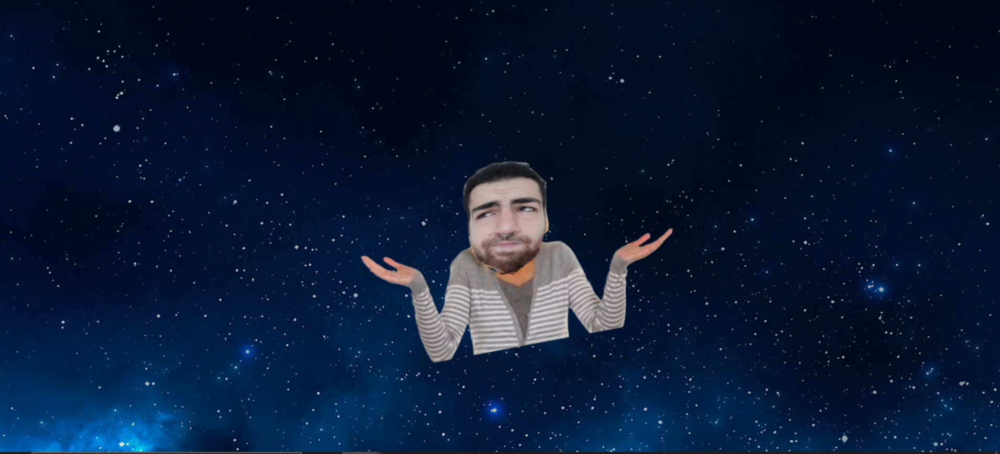

# 404-page

> 404 page with animation and your picture in it!

[](https://www.npmjs.com/package/404-page) [](https://standardjs.com)

## Install

```bash
npm install --save 404-page
```

## Usage

```jsx
import React from 'react'

import {LostPage} from '404-page'
import '404-page/dist/index.css'

const Example = () => {
  
    return <LostPage face={ optional your face image (default is my face) } backgroundColor={ optional (default is space)} audio={ optional your audio} />
  
}
```
## Optional parameters:
1. face > default is my face image with your face. 
2. backgroundColor > default is space  you can choose from cool linear gradient backgrounds (purple,black and blue). 
3. audio > audio to play in your 404 page. 

## Some preview:


## License

MIT © [ShaharEli](https://github.com/ShaharEli)
